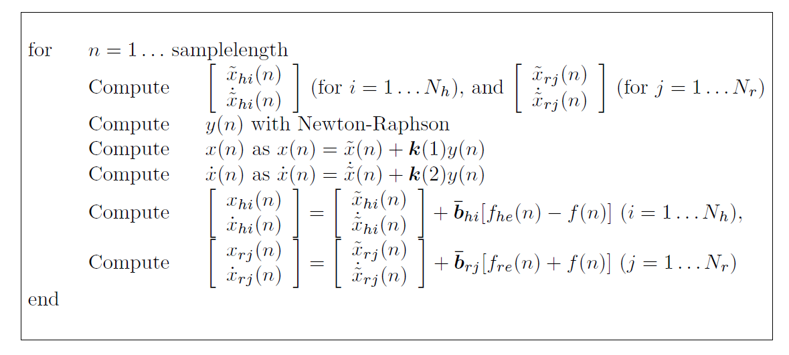

<!-- omit in toc -->
# Sound Design Toolkit - Impact Model VST3 Plugin
<!-- omit in toc -->
### A plugin realization of the impact model from the [Sound Design Toolkit](http://www.soundobject.org/SDT/) created with [JUCE](https://juce.com/)

<!-- omit in toc -->
## Contents
- [Introduction](#introduction)
- [Impact Model](#impact-model)
    - [Description](#description)
    - [Modal resonators](#modal-resonators)
    - [Discretization](#discretization)
    - [Impact interaction](#impact-interaction)
    - [Synthesis Algorithm](#synthesis-algorithm)
- [Impact Model Plugin](#impact-model-plugin)
    - [Software Architecture](#software-architecture)
 
## Introduction
The Sound Design Toolkit consists in a library of ecologically founded (e.g physics based) sound synthesis algorithms. 

In this project the entire SDT library is ported in C++ and integrated in the JUCE framework for the realization of a VST3 plugin version of the impact model.
 
## Impact Model
### Description
The impact model is one of the two basics solid interaction models implemented by the Sound Design Toolkit. The sound synthesis method implemented in the impact model is the modal synthesis, where the sound of an object is represented as a linear combination of modes, i. e. the solutions to N second order damped harmonical oscillators.
The interaction algorithm has a modular structure "resonator–"interactor–resonator", representing the interaction between two resonating objects, which are described through 
modal synthesis.

### Modal resonators

The simplest mechanical oscillating system made of lumped elements (such as masses, springs or dampers), called resonator is

where x is the oscillator displacement while k, m, g are the stiffness mass damping parameters. The pitch and quality factor of the resonator are

We can model a parallel connection of N oscillating system, made of lumped mechanical elements, by choosing different stiffness 

and account for a set of partials of the resonator spectrum (pitches)

The resulting model equations, in matrix form are the following:

The displacement of the resonator is obtained in this way

while the velocity of the resonator is

### Discretization

The systems of equations is discretized using bilinear transform, where Fs is the sampling frequency. The resulting numerical system is:

with

### Impact interaction

The model for the non linear impact force between the two colliding modal resonator is

where the parameter 'lambda is the force damping weight.

Marhefka and Orin have studied the collision of a hammer onto a massive surface, which is assumed not to move during collision. When the two objects collide, the hammer initial conditions are given by xh = 0 (hammer position) and x˙ h = vin (hammer velocity).

In the project the impact model by Marhefka and Orin is implemented as a VST3 plugin through the JUCE Framework. The model implemented  describes a collision between two modal objects, As a special case, one object can be a “rigid wall”, i.e. a modal object with an ideally infinite mass. For clarity, the two objects are denoted with the subscripts “h” and “r”, which stand for “hammer” and “resonator”, respectively.

The two objects interact through the impact contact force f(x, x˙). The full system is

where xh and xr are the modal displacements of the hammer and the resonator, respectively. The terms fhe, fre represent external forces, while the integers Nh and Nr are the number of modes for the hammer and the resonator, respectively.

The discretized system, using th bilinear transform, is

### Synthesis Algorithm

The synthesis algorithm is the following

## Impact Model Plugin
The impact model plugin was implemented by taking as a reference the sdt.impact Max/Msp patch from the [Sound Design Toolkit](http://www.soundobject.org/SDT/). 

In this particular realization of the impact model there are two resonators, they expose one or more pickup points, object displacement and velocity can be read at any time from these pickup points. The two resonators implemented in this impact model are:
- Inertial mass: Simulates a simple inertial point mass, mostly used as exciter for modal resonators;
- Modal resonator: Physical model of a set of parallel mass–spring–damper mechanical oscillators, with each oscillator representing a resonant frequency of the object.

Interactor algorithms read the state of exactly two pickup points, one for each interacting resonator, and apply a force accordingly.

### Software Architecture

The SDT library is ported in C++ through the creation of a series of class wrappers, this to preserve modularity. The DSP audio processing has been separated from the resonators
and interactors methods, in this way we have a template to use for all the SDT class wrappers. The audio processing in the DspProcess class is a sample-by-sample processing,
the creation of the buffer is delegated to the processBlock method of the PluginProcessor class. The software architecture is the following:

The final audio processing is realized by the processBlock method of the Pluginprocessor class, this method is called in the main audio thread of the plugin. To connect the user parameters, that can be changed in the GUI, in a safe way a real time audio processing logic is implemented in the plugin :

## References

